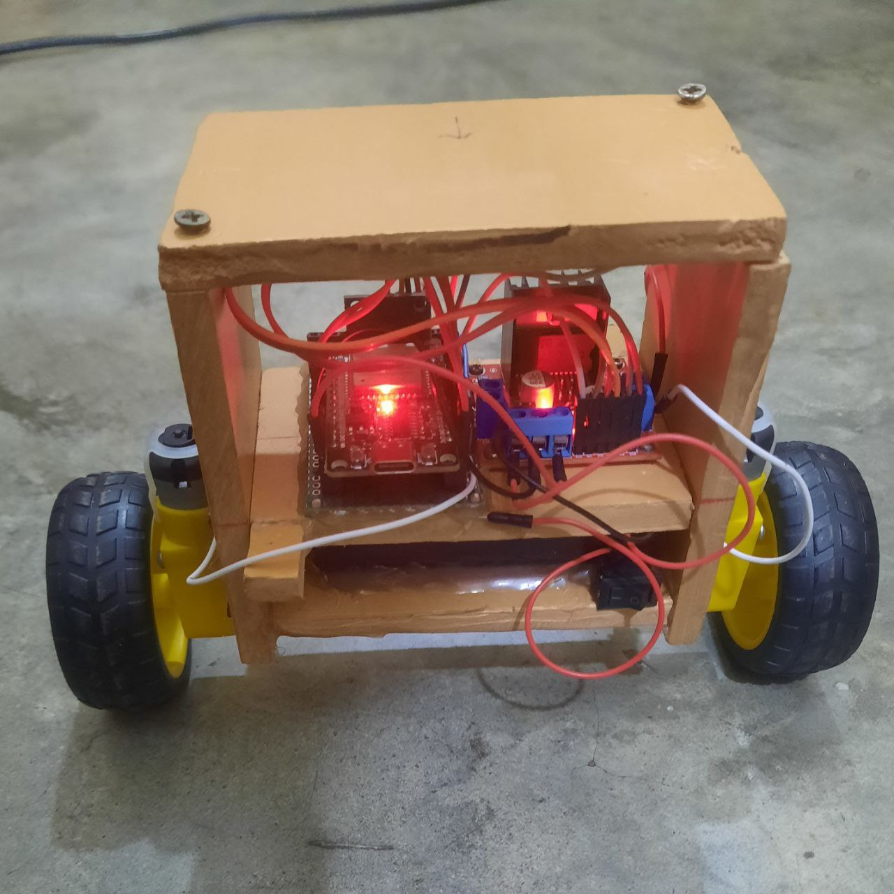

# Self_Balancing_Car_with_DMP_Algorithm_and_My_PID

Here you can find the full code with my implemented PID algorithm.

### Importants:
- You may need to tune your kp, ki, and kd value for your own salf balancing car but can try with my value or slightly change a little.
- You must need to install the DMP libray "MPU6050_6Axis_MotionApps20.h" and "I2Cdev.h" library. You can find the link in my code even you can find these libray in github also.
- Do google for these library

### Image

